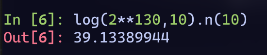

挑点跟分解质因数有关的题做做。倒也不是说这些题做法相似，只不过都是给了些关于素因数的额外信息，然后想办法利用这些信息去解RSA。

## AlpacaHack Round 3 - Rainbow Sweet Alchemist

```python title="task.py"
import os
import random
from math import prod
from Crypto.Util.number import isPrime, bytes_to_long

r = random.Random(0)
def deterministicGetPrime():
  while True:
    if isPrime(p := r.getrandbits(64)):
      return p

# This is not likely to fail
assert deterministicGetPrime() == 2710959347947821323, "Your Python's random module is not compatible with this challenge."

def getPrime(bit):
  factors = [deterministicGetPrime() for _ in range(bit // 64)]
  while True:
    p = 2 * prod(factors) + 1
    if isPrime(p):
      return p
    factors.remove(random.choice(factors))
    factors.append(deterministicGetPrime())

flag = os.environ.get("FLAG", "fakeflag").encode()
m = bytes_to_long(flag)

p, q = getPrime(1024), getPrime(1024)
n = p * q
e = 0x10001
c = pow(m, e, n)

print(f"{n=}")
print(f"{e=}")
print(f"{c=}")
```

素数是拿一堆64 bits的deterministicPrime再加上一些随机的prime去生成的。这个素数生成方式一看就会觉得比较像光滑数那套东西，并且p-1的因子是通过deterministicGetPrime()生成的，所以直接拿它的方式生成deterministicPrime然后拿去pollard p-1就好了。

本地生成数据测试一下:

```txt collapse={1-3} title=data.txt
n=160836544037910609005780702840165144068490234071854739366259912370392021076162916908702610103919348574435852754290816429580095072837120435975860749774167077491150887237325177752814819594099069509673116704614282426710640390809184105755337634828025495668016233827749767515861968807361207644166645232738546335987072305559426271004929819939657344282341216361231946634442046776703779492052787601546596196615984327207554025268885162611428039402102968138061378958552034317041644642199476417863048058175952288091064095980612330416790623259640251348133728428585845944609236301175564125437779808581385619776495153
e=65537
c=118707624155875859009358958766331195664386597352681752983738108218395299110736747069989506131216691251322359417233027264547530843040314710981659802130681627977793468801786294244641830546848712365256323684323873286345491561980129378805654203629862398466381689583050212391463467895889393150259213417246822075653572977971738913147466928929696260238201706327097882191399023863349288842190379528694171322417557695844727901469288657315762970276151355204666133947517888145117922624608766623891093435209969564448590959028819595013869821164200043020655201774161682008634247207294514649792778252870547275362679891
```

```python collapse={1-3} title="exp.py"
n=160836544037910609005780702840165144068490234071854739366259912370392021076162916908702610103919348574435852754290816429580095072837120435975860749774167077491150887237325177752814819594099069509673116704614282426710640390809184105755337634828025495668016233827749767515861968807361207644166645232738546335987072305559426271004929819939657344282341216361231946634442046776703779492052787601546596196615984327207554025268885162611428039402102968138061378958552034317041644642199476417863048058175952288091064095980612330416790623259640251348133728428585845944609236301175564125437779808581385619776495153
e=65537
c=118707624155875859009358958766331195664386597352681752983738108218395299110736747069989506131216691251322359417233027264547530843040314710981659802130681627977793468801786294244641830546848712365256323684323873286345491561980129378805654203629862398466381689583050212391463467895889393150259213417246822075653572977971738913147466928929696260238201706327097882191399023863349288842190379528694171322417557695844727901469288657315762970276151355204666133947517888145117922624608766623891093435209969564448590959028819595013869821164200043020655201774161682008634247207294514649792778252870547275362679891
import os
import random
from math import prod
from Crypto.Util.number import isPrime, long_to_bytes, inverse
import gmpy2
r = random.Random(0)
def deterministicGetPrime():
  while True:
    if isPrime(p := r.getrandbits(64)):
      return p
def pollard(n) -> tuple:
    a = 65536
    while True:
        a = gmpy2.powmod(a, deterministicGetPrime(), n)
        p = gmpy2.gcd(a - 1, n)
        if p != 1 and p != n and p * (n // p) == n:
            return p, n//p
p, q = pollard(n)
phi = (p - 1) * (q - 1)
d = inverse(e, phi)
m = gmpy2.powmod(c, d, n)
flag = long_to_bytes(m)
print(flag)
# fakeflag
```

成功🥳

## AlpacaHack Round 3 - qrime

```python title="task.py"
import os
from Crypto.Util.number import bytes_to_long, getRandomNBitInteger, isPrime

def nextPrime(n):
    while not isPrime(n := n + 1):
        continue
    return n

def gen():
    while True:
        q = getRandomNBitInteger(256)
        r = getRandomNBitInteger(256)
        p = q * nextPrime(r) + nextPrime(q) * r
        if isPrime(p) and isPrime(q):
            return p, q, r

flag = os.environ.get("FLAG", "fakeflag").encode()
m = bytes_to_long(flag)

p, q, r = gen()
n = p * q

phi = (p - 1) * (q - 1)
e = 0x10001
d = pow(e, -1, phi)
c = pow(m, e, n)

print(f"{n=}")
print(f"{e=}")
print(f"{c=}")
print(f"{r=}")
```

这题的p,q满足

$$
n = pq \\
p = q(r+x_1)+(q+x_2)r
$$

其中 $x_1$ 和 $x_2$ 都比较小，然后额外给了 $r$ ，目标就是利用 $r$ 去分解 $n$ 。

见到这种关系第一反应就是考虑 $\bmod \ r$ 下的性质，那么有 $p\equiv qx_1 \pmod{r} \Rightarrow n\equiv q^2x_1 \pmod{r}$

如果 $x_1$ 在 $\pmod{r}$ 下有逆，也就是 $gcd(x_1, r)=1$ ，那么爆破 $x_1$ 后对 $nx_1^{-1}$ 开根后就能拿到 $q$ ；如果 $r$ 是素数，那么就能让 $gcd(x_1, r)=1$ 对于所有小于 $r$ 的数成立。问题在于，原题是静态的，没办法通过反复重连使得 $r$ 为素数🤔

当然就算r不是素数我们也能在r的素因子 $r_k$ 里去尝试求q，那样求出的q无非是 $\pmod{r_k}$ 而已，然后Coppersmith也不是不行，这题的数据范围也刚好可以Copper($r_{max}$ 有186bits，q只有256bits)。

:::note
可以预先判断下是不是二次剩余，减少需要Copeprsmith的candidates数
:::

```python collapse={1-4} title="exp.py"
n = 200697881793620389197751143658858424075492240536004468937396825699483210280999214674828938407830171522000573896259413231953182108686782019862906633259090814783111593304404356927145683840948437835426703183742322171552269964159917779
e = 65537
c = 77163248552037496974551155836778067107086838375316358094323022740486805320709021643760063197513767812819672431278113945221579920669369599456818771428377647053211504958874209832487794913919451387978942636428157218259130156026601708
r = 30736331670163278077316573297195977299089049174626053101058657011068283335270
from tqdm import trange
from Crypto.Util.number import inverse, long_to_bytes
proof.all(False)
r_max = factor(r)[-1][0]
F = GF(r_max)
for x_cand in trange(1,2000):
    tmp = Zmod(r // gcd(r, x_cand))(n) / x_cand
    if not tmp.is_square():
        continue
    q_r = ZZ(F(tmp).sqrt())
    x = polygen(Zmod(n))
    f = (r_max * x + q_r).monic()
    try:
        res = f.small_roots(X=2**256 // r_max, beta=0.33, epsilon=0.015)[0]
        q = gcd(n, ZZ(f(res)))
        if q != 1 and q != n:
            p = n // q
            assert p * q == n
            break
    except:
        continue
phi = (p-1) * (q-1)
d = inverse(e, phi)
flag = long_to_bytes(pow(c, d, n))
print(flag)
#   9%|███████████▏                                                                                                                 | 178/1999 [00:00<00:08, 216.54it/s]
# b'Alpaca{q_and_r_have_nothing_to_do_with_QR_code}'
```

## 2024 DASCTF 暑期挑战赛 - 1z_RSA

```python title="task.py"
from Crypto.Util.number import *
from sympy import *
import os
from secrets import flag

nbit =130
e = 65537
l = getPrime(505)
m = bytes_to_long(flag + os.urandom(64))

assert len(flag) == 29

while True:
    p, q = getPrime(nbit), getPrime(nbit)
    PQ = int(str(p<<120)+str(q))
    QP = int(str(q<<120)+str(p))
    if isPrime(PQ) and isPrime(QP):
        break

n = PQ * QP
PP = nextprime((PQ >> 190) * (QP & (2 ** 190 - 1)))
QQ = nextprime((QP >> 190) * (PQ & (2 ** 190 - 1)))
N = PP * QQ
M = pow(m,1,l)
c = pow(m,e,N)

print('n =', n)
print('c =', c)
# n = 16445702053284878471661149821929236160827349860248398845138927737656956155376460402218197208193336565070826064696649172229472596804167403573551471681598293095327847455986697781130763893067438016088641806277728646579590680432425469
# c = 887267289769222134322645658185740890076570973814978825206856442917869951183407787099985715495254579291183691081385458063887609704126682101105986126757195338464870470784104063964312361198792751675180153036987799155562165373093688
```

这题的数据中，N由n的因子决定，得想办法分解n=PQ*QP。

PQ和QP的生成方式是这样的:

```python
p, q = getPrime(130), getPrime(130)
PQ = int(str(p<<120)+str(q))
QP = int(str(q<<120)+str(p))
```

看起来 $PQ = 2^{120}10^{x}p+q, QP = 2^{120}10^{y}q+p$

测一下：



那么x和y的取值范围就是39或40。二元Copper走起

```python title="copper.py"
def small_roots(f, bounds, m, d=None):
    if not d:
        d = f.degree()
 
    R = f.base_ring()
    N = R.cardinality()
    
    f /= f.coefficients().pop(0)
    f = f.change_ring(ZZ)
 
    G = Sequence([], f.parent())
    for i in range(m+1):
        base = N^(m-i) * f^i
        for shifts in itertools.product(range(d), repeat=f.nvariables()):
            g = base * prod(map(power, f.variables(), shifts))
            G.append(g)
 
    B, monomials = G.coefficient_matrix()
    monomials = vector(monomials)
 
    factors = [monomial(*bounds) for monomial in monomials]
    for i, factor in enumerate(factors):
        B.rescale_col(i, factor)
 
    B = B.dense_matrix().LLL()
 
    B = B.change_ring(QQ)
    for i, factor in enumerate(factors):
        B.rescale_col(i, 1/factor)
 
    H = Sequence([], f.parent().change_ring(QQ))
    for h in filter(None, B*monomials):
        H.append(h)
        I = H.ideal()
        if I.dimension() == -1:
            H.pop()
        elif I.dimension() == 0:
            roots = []
            for root in I.variety(ring=ZZ):
                root = tuple(R(root[var]) for var in f.variables())
                roots.append(root)
            return roots
    return []
from Crypto.Util.number import *
import itertools
n = 16445702053284878471661149821929236160827349860248398845138927737656956155376460402218197208193336565070826064696649172229472596804167403573551471681598293095327847455986697781130763893067438016088641806277728646579590680432425469
c = 887267289769222134322645658185740890076570973814978825206856442917869951183407787099985715495254579291183691081385458063887609704126682101105986126757195338464870470784104063964312361198792751675180153036987799155562165373093688
PR = PolynomialRing(Zmod(n), "p, q")
p, q = PR.gens()
f = (2**120*10**39*(2*p+1)+(2*q+1))*(2**120*10**40*(2*q+1)+(2*p+1))
bounds = (2**130, 2**130)
print(small_roots(f, bounds, m=2, d=4))
# [(590352663997702178900249614724312559588, 394168522856050219618619947492543239498), (16445702053284878471661149821929236160827349860248398845138927737656956155376460402218197208193336565070826064696649172229472596804167403573551471681598293095327847455986697781130763893067437425735977808575549746329975956119865880, 16445702053284878471661149821929236160827349860248398845138927737656956155376460402218197208193336565070826064696649172229472596804167403573551471681598293095327847455986697781130763893067437621920118950227509027959643187889185970)]
```

几秒钟就能Copper出来。

```python title="get_flag.py"
from Crypto.Util.number import *
res = [(590352663997702178900249614724312559588, 394168522856050219618619947492543239498), (16445702053284878471661149821929236160827349860248398845138927737656956155376460402218197208193336565070826064696649172229472596804167403573551471681598293095327847455986697781130763893067437425735977808575549746329975956119865880, 16445702053284878471661149821929236160827349860248398845138927737656956155376460402218197208193336565070826064696649172229472596804167403573551471681598293095327847455986697781130763893067437621920118950227509027959643187889185970)]
n = 16445702053284878471661149821929236160827349860248398845138927737656956155376460402218197208193336565070826064696649172229472596804167403573551471681598293095327847455986697781130763893067438016088641806277728646579590680432425469
c = 887267289769222134322645658185740890076570973814978825206856442917869951183407787099985715495254579291183691081385458063887609704126682101105986126757195338464870470784104063964312361198792751675180153036987799155562165373093688
p,q = 2*int(res[0][1])+1,2*int(res[0][0])+1
PQ = int(str(p<<120)+str(q))
QP = int(str(q<<120)+str(p))
PP = next_prime((PQ >> 190) * (QP & (2 ** 190 - 1)))
QQ = next_prime((QP >> 190) * (PQ & (2 ** 190 - 1)))
phi = (PP-1)*(QQ-1)
d = inverse(65537, phi)
print(long_to_bytes(pow(c,d,PP*QQ)))
# b'flag{dummy_flag_for_testing!}\x8b\x11dl\xfd\xd0Xe\xd0\x99\x8d\xc4?\xc3\xae\x81\x98\xdfa) >\xfd\x00\xdc\xa7?\xed\xb2\xd2\x17\x0c\t\x18\xdf\x80\xf7\xbb\xa1\x90\x00C\x89\xe2-EU\xe6\xf6;\xcf\xca<\x9fG\x0f\xcc\xb9\x0b\x0f\x825\x8f\xcd'
```

:::note
原题的e是3,所以八成会有不互素的问题要AMM，跟想练的东西没关系，这里直接改成了65537。并且原题多给了 $M\%l$ 的信息，使得直接Copper似乎也是可以的，这里用的例子修复了这个非预期😂
:::

`因为还在外面旅游所以姑且先切三道题:P`